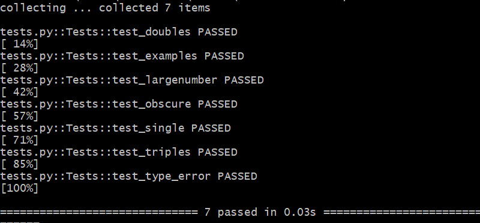
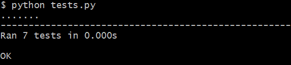

# Tech Test
link to the github repo: https://github.com/samturton2/TechTest-Raindrops

## The Task

Write a function that takes as its input a number (n) and converts it to a string, the contents of which depend on the numbers factors

- if the number has a factor of 3, output 'Pling'
- if the number has a factor of 5, output 'Plang'
- if the number has a factor of 7, output 'Plong'
- if the number does not have any of the above as a factor simply return the numbers digits

#### Examples
- 28's factors are 1, 2, 4, 7, 14 and 28: this would be a simple 'Plong'
- 30's factors are 1, 2, 3, 5, 6, 10, 15, 30: this would be a 'PlingPlang'
- 34 has four factors: 1, 2, 17, and 34: this would be '34'

## My Code
- My code consists of 2 files, `main.py`, and `tests.py`.
- The tests will be used to help develop the main.py file, which holds the function that completes the task.

### The function
- The function to carry out the task was as follows
```python
def raindrops(n):
    output = ""
    if n%3 == 0:
        output += "Pling"
    if n%5 == 0:
        output += "Plang"
    if n%7 == 0:
        output += "Plong"

    if len(output) > 0:
        return output
    else:
        return str(n)
```
- The code takes in a number, and will check for factors of 3, 5 & 7.
- If a factor is found, the corresponding word is added to the dummy output. 
- Finally the code will check to see if the dummy output was changed, and if so returns that. If not it returns a string of the input number.
- _Note at the bottom of the `main.py` file there is a small function that can run when I ran the file directly._

### Testing
- The tests can by run using either pytest, or unittest
- To carry it out you will need to run the following command in the terminal
```bash
pip install -r requirements.txt
```

#### pytest
- To run pytest Type the following command
```bash
python -m pytest -v tests.py
```


#### unitest
- To run unitest, just run the `tests.py` file on python
```bash
python tests.py
```


#### Unit Testing
- The tests were set up in a series of unit tests inside the Tests class.
- The tests were made to test lots of possible outcomes that the function would supposedly achieve.
- This was done using pythons assertEqual, and assertRaises functions.
- The tests were made to account for a range of possibilities :
    + The examples given in the Documentation
    + Single, Double, and triple word concatinations
    + Large numbers
    + Negative numbers
    + Floats
    + Strings (tested expecting a type error)

- The development of the code was done in a TDD manner, Writing failing tests to go back and modify the code, so that it was fully functional for as many inputs as possible.
